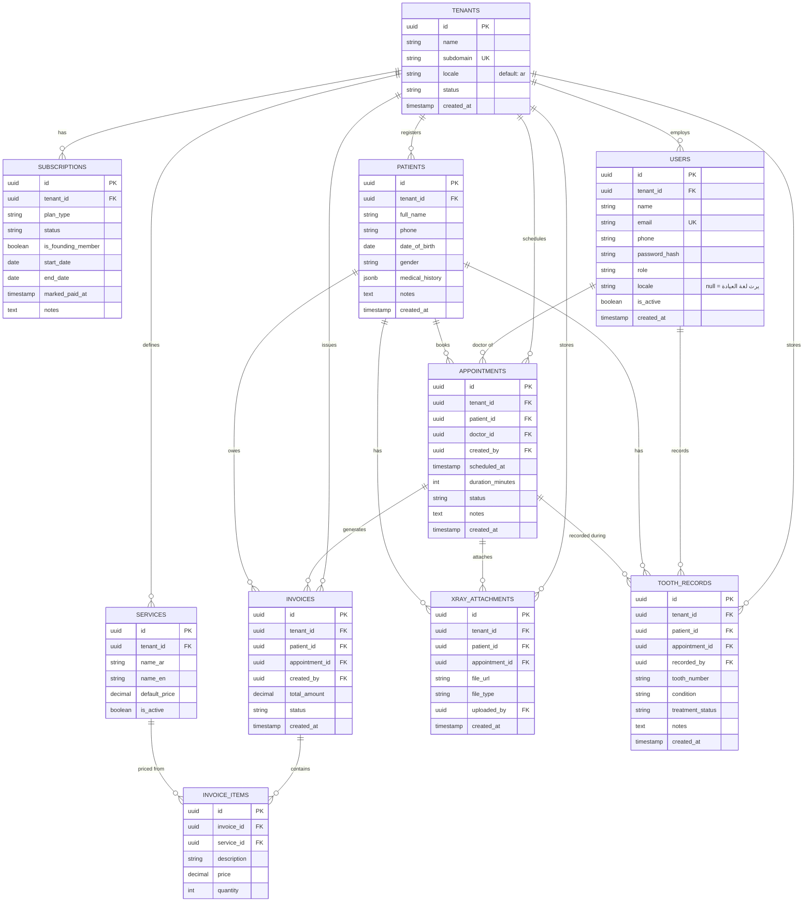

# ERD - نظام إدارة عيادات الأسنان (Multi-tenant)

> هذا الملف مصدره الرئيسي في الريبو تحت المسار `/docs/erd.md`
> النسخة الجاهزة للاستيراد المباشر في dbdiagram.io موجودة في `/docs/schema.dbml`
> أي تعديل مستقبلي في الجداول لازم ينعكس هنا أولاً قبل الـ migration.

## القرارات المعمارية المنعكسة في التصميم

- **Multi-tenancy**: عزل عبر `tenant_id` في كل جدول بيانات + Laravel Global Scopes.
- **السجل الطبي العام**: حقل مرن (`medical_history` jsonb) للملاحظات العامة والحساسية والتاريخ المرضي العام.
- **سجل الأسنان التفصيلي (Odontogram)**: جدول تاريخي منفصل `tooth_records` - كل صف يمثل ملاحظة/إجراء على سن معين (ترقيم FDI) في زيارة معينة، يحتفظ بتاريخ العلاج الكامل مش الحالة الحالية بس.
- **الفوترة**: هجينة - بند من قائمة أسعار ثابتة (`service_id` موجود) أو بند حر يكتبه الطبيب وقتها (`service_id` = null).
- **علاقة الطبيب بالمريض**: غير مقيدة - أي طبيب في العيادة يقدر يشوف أي مريض. الربط بالطبيب موجود فقط على مستوى الموعد وسجل السن.
- **اللغتان (عربي أساسي / إنجليزي ثانوي)**:
  - `tenants.locale` قيمته الافتراضية `ar`.
  - `users.locale` حقل اختياري يسمح لعضو فريق معين يفضّل لغة مختلفة عن لغة العيادة الافتراضية؛ لو فاضي بيرث لغة العيادة.
  - `services` انقسم لـ `name_ar` (إلزامي) و`name_en` (اختياري) لأنه محتوى بيتطبع في فواتير/مستندات رسمية.
  - القيم الداخلية للأنظمة (`status`, `role`, `condition`, `treatment_status`) تفضل قيم إنجليزية ثابتة في قاعدة البيانات، والترجمة بتتم في طبقة الـ Frontend (`next-intl`) - مفيش تكرار للقيم دي في قاعدتين لغة.
  - النصوص الحرة (اسم المريض، الملاحظات، بنود الفاتورة الحرة) بتتكتب باللغة اللي المستخدم مرتاح ليها، من غير أعمدة مزدوجة.

## مخطط الجداول (Mermaid - للعرض المباشر داخل GitHub)

## نسخة DBML (للاستيراد المباشر في dbdiagram.io)

راجع الملف المستقل `/docs/schema.dbml` في نفس المجلد - انسخ محتواه والصقه في محرر dbdiagram.io مباشرة، أو استورده كملف.

## ملاحظات على الحقول

- **`appointments.status`**: `scheduled`, `completed`, `cancelled`, `no_show`.
- **`subscriptions.status`**: `trial`, `active`, `expired` - يتحدث يدوياً من الـ admin dashboard الداخلي.
- **`users.role`**: `owner`, `doctor`, `receptionist`.
- **`invoices.status`**: `paid`, `unpaid`, `partial`.
- **`tooth_records.tooth_number`**: ترميز FDI (رقمين، مثال `11` إلى `48`).
- **`tooth_records.condition`**: `healthy`, `decayed`, `filled`, `missing`, `crown`, `root_canal`, `needs_extraction`, `impacted` - تُطبَّق كـ validation rule وليس enum جامد في قاعدة البيانات.
- **`tooth_records.treatment_status`**: `planned`, `in_progress`, `completed`.
- **لا يوجد unique constraint على `(patient_id, tooth_number)`** بشكل متعمد - الجدول تاريخي.

## الفهارس المركبة المطلوبة من أول migration

| الجدول | الفهرس | السبب |
|---|---|---|
| appointments | `(tenant_id, patient_id)` | سرعة جلب سجل مواعيد مريض معين |
| appointments | `(tenant_id, scheduled_at)` | سرعة شاشة "مواعيد اليوم" |
| invoices | `(tenant_id, patient_id)` | سرعة جلب فواتير مريض معين |
| xray_attachments | `(tenant_id, patient_id)` | سرعة جلب أشعة مريض معين |
| tooth_records | `(tenant_id, patient_id, tooth_number)` | سرعة جلب تاريخ سن معين لمريض معين |
| tooth_records | `(tenant_id, patient_id, created_at)` | سرعة بناء الحالة الحالية لكل أسنان المريض |
| subscriptions | `(tenant_id, status)` | سرعة فلترة العيادات حسب حالة الاشتراك في لوحة الـ admin |
| patients | GIN index على `medical_history` | بحث داخل محتوى الـ JSON |

## تحديثات مستقبلية متوقعة (لا تكسر التصميم الحالي)

- إضافة نظام تنبيهات SMS/WhatsApp لاحقاً (جدول تذكيرات منفصل مرتبط بـ appointments).
- تفعيل PostgreSQL Native Partitioning على `appointments` و`tooth_records` عند الحاجة.
- إضافة Row-Level Security (RLS) كطبقة أمان ثانية عند التوسع لعدد أكبر من العيادات.
