# ERD - نظام إدارة عيادات الأسنان (Multi-tenant)

> هذا الملف مصدره الرئيسي في الريبو تحت المسار `/docs/erd.md`
> النسخة الجاهزة للاستيراد المباشر في dbdiagram.io موجودة في `/docs/schema.dbml`
> أي تعديل مستقبلي في الجداول لازم ينعكس هنا أولاً قبل الـ migration.

## سجل التعديلات (Changelog)

| التاريخ | التعديل |
|---|---|
| هذه النسخة | تتبع العلاج: قوالب بإصدارات + خطط + علاجات مريض (سريري/مالي/موافقة مستقلين) + جلسات + خطوات + أسنان متعددة |
| هذه النسخة | إضافة `ADMIN_USERS` (super admin منفصل، route/guard مختلف عن باقي النظام) |
| هذه النسخة | حذف `subscriptions.is_founding_member` |
| هذه النسخة | إلغاء `PATIENT_REVIEWS` وكل ما يتعلق بها (تم التراجع عنها) |
| هذه النسخة | إضافة `AUDIT_LOGS` (تسجيل تاريخي كامل للتعديلات على الجداول الحساسة - القيم القديمة والجديدة) |
| هذه النسخة | إضافة `PAYMENTS` (دعم الدفع على أكثر من دفعة بمبلغ متغير) |
| هذه النسخة | `invoice_items.service_id` أصبح `NOT NULL` - يوجد صف ثابت "أخرى/Other" في `services` يُستخدم للحالات النادرة، والوصف الفعلي يُكتب في `invoice_items.description` |
| هذه النسخة | توضيح سياسة: `appointments.doctor_id` يُحدَّث دائمًا للدكتور الذي كشف فعليًا (وليس بالضرورة من تم الحجز معه أصلًا) |

## القرارات المعمارية المنعكسة في التصميم

- **Multi-tenancy**: عزل عبر `tenant_id` في كل جدول بيانات + Laravel Global Scopes.
- **Super Admin منفصل تمامًا عن tenants**: `ADMIN_USERS` جدول مستقل خارج نطاق أي `tenant_id`، بـ guard وroute group مختلفين تمامًا (مثال: كل الـ routes تحت `/admin/*` أو subdomain منفصل مستقبلًا)، عشان مفيش تداخل أو تسريب صلاحيات بين "مدير عيادة" و"مدير المنصة".
- **السجل الطبي العام**: حقل مرن (`medical_history` jsonb) للملاحظات العامة والحساسية والتاريخ المرضي العام.
- **سجل الأسنان التفصيلي (Odontogram)**: جدول تاريخي منفصل `tooth_records` - كل صف يمثل ملاحظة/إجراء على سن معين (ترقيم FDI) في زيارة معينة، يحتفظ بتاريخ العلاج الكامل مش الحالة الحالية بس.
- **الفوترة**: كل بند فاتورة مرتبط إلزاميًا بخدمة من `services` (`service_id NOT NULL`). الحالات النادرة/غير المُسعّرة مسبقًا تُسجَّل تحت خدمة ثابتة اسمها "أخرى/Other"، والوصف الفعلي للإجراء يُكتب في `invoice_items.description` - بهذا تبقى كل التقارير موحّدة بدون استثناءات على `NULL`.
- **تتبع العلاج (5 مستويات)**: `treatment_templates` (إصدارات غير قابلة للتعديل في مكانها) → `treatment_plans` اختياري → `patient_treatments` → `treatment_sessions` → `treatment_session_steps`. الحالة السريرية والمالية والموافقة والمواعيد مستقلة. الأسنان عبر جدول وسيط (0/1/كثير). لون العلاج على الأودونتوجرام مشتق وليس مخزَّنًا.
- **الدفع بأقساط متغيرة**: جدول `payments` منفصل يسجّل كل دفعة فعلية (مبلغ + تاريخ + طريقة دفع) مرتبطة بفاتورة، فيصبح `invoices.status` وحساب المتبقي قابلين للاشتقاق (computed) من مجموع الدفعات بدل تحديد يدوي جامد.
- **Audit Log**: جدول `audit_logs` منفصل (append-only) يسجّل كل عملية إنشاء/تعديل/حذف على الجداول الحساسة (الفواتير، الدفعات، سجل الأسنان، المواعيد)، مع حفظ القيم قبل وبعد التعديل (`old_values`/`new_values` كـ jsonb) - هذا اختيار متعمد بديل عن أعمدة `created_by/updated_by` البسيطة، لأنه يوفر تاريخًا كاملاً للتغييرات وليس آخر تعديل فقط.
- **علاقة الطبيب بالمريض**: غير مقيدة - أي طبيب في العيادة يقدر يشوف أي مريض. الربط بالطبيب موجود فقط على مستوى الموعد وسجل السن. **سياسة تشغيلية مهمة**: `appointments.doctor_id` يعكس دائمًا الطبيب الذي كشف على المريض فعليًا في الموعد، حتى لو اختلف عن الطبيب الذي تم الحجز معه أصلًا وقت إنشاء الموعد - يُحدَّث الحقل وقت/بعد الكشف الفعلي.
- **اللغتان (عربي أساسي / إنجليزي ثانوي)**:
  - `tenants.locale` قيمته الافتراضية `ar`.
  - `users.locale` حقل اختياري يسمح لعضو فريق معين يفضّل لغة مختلفة عن لغة العيادة الافتراضية؛ لو فاضي بيرث لغة العيادة.
  - `services` انقسم لـ `name_ar` (إلزامي) و`name_en` (اختياري) لأنه محتوى بيتطبع في فواتير/مستندات رسمية.
  - القيم الداخلية للأنظمة (`status`, `role`, `condition`, `treatment_status`) تفضل قيم إنجليزية ثابتة في قاعدة البيانات، والترجمة بتتم في طبقة الـ Frontend (`next-intl`) - مفيش تكرار للقيم دي في قاعدتين لغة.
  - النصوص الحرة (اسم المريض، الملاحظات، بنود الفاتورة الحرة) بتتكتب باللغة اللي المستخدم مرتاح ليها، من غير أعمدة مزدوجة.

## مخطط الجداول (Mermaid - للعرض المباشر داخل GitHub)

```mermaid
erDiagram
    ADMIN_USERS {
        uuid id PK
        string name
        string email UK
        string password_hash
        boolean is_active
        timestamp created_at
    }
    TENANTS ||--o{ SUBSCRIPTIONS : has
    TENANTS ||--o{ USERS : employs
    TENANTS ||--o{ PATIENTS : registers
    TENANTS ||--o{ APPOINTMENTS : schedules
    TENANTS ||--o{ SERVICES : defines
    TENANTS ||--o{ INVOICES : issues
    TENANTS ||--o{ XRAY_ATTACHMENTS : stores
    TENANTS ||--o{ TOOTH_RECORDS : stores
    TENANTS ||--o{ AUDIT_LOGS : logs
    TENANTS ||--o{ COMPONENTS : stocks
    TENANTS ||--o{ TREATMENT_TEMPLATES : catalogs
    TENANTS ||--o{ TREATMENT_PLANS : plans
    USERS ||--o{ APPOINTMENTS : "doctor of"
    USERS ||--o{ AUDIT_LOGS : performs
    USERS ||--o{ TOOTH_RECORDS : records
    PATIENTS ||--o{ APPOINTMENTS : books
    PATIENTS ||--o{ TOOTH_RECORDS : has
    APPOINTMENTS ||--o{ INVOICES : generates
    APPOINTMENTS ||--o{ XRAY_ATTACHMENTS : attaches
    APPOINTMENTS ||--o{ TOOTH_RECORDS : "recorded during"
    PATIENTS ||--o{ INVOICES : owes
    PATIENTS ||--o{ XRAY_ATTACHMENTS : has
    INVOICES ||--o{ INVOICE_ITEMS : contains
    INVOICES ||--o{ PAYMENTS : "paid via"
    SERVICES ||--o{ INVOICE_ITEMS : "priced from"
    PATIENTS ||--o{ TREATMENT_PLANS : plans
    PATIENTS ||--o{ PATIENT_TREATMENTS : receives
    TREATMENT_TEMPLATES ||--o{ TREATMENT_TEMPLATE_STEPS : defines
    TREATMENT_TEMPLATE_STEPS ||--o{ TREATMENT_TEMPLATE_COMPONENTS : uses
    COMPONENTS ||--o{ TREATMENT_TEMPLATE_COMPONENTS : "priced from"
    TREATMENT_PLANS ||--o{ PATIENT_TREATMENTS : groups
    TREATMENT_TEMPLATES ||--o{ PATIENT_TREATMENTS : "version snapshot"
    PATIENT_TREATMENTS ||--o{ PATIENT_TREATMENT_TEETH : "applied to"
    PATIENT_TREATMENTS ||--o{ TREATMENT_SESSIONS : sessions
    PATIENT_TREATMENTS ||--o{ PATIENT_TREATMENTS : retreatment
    APPOINTMENTS ||--o{ TREATMENT_SESSIONS : "may include"
    TREATMENT_SESSIONS ||--o{ TREATMENT_SESSION_STEPS : logs
    TREATMENT_SESSIONS ||--o{ PATIENT_TREATMENT_COMPONENTS : consumes
    PATIENT_TREATMENTS ||--o{ INVOICE_ITEMS : "billed as"

    TENANTS {
        uuid id PK
        string name
        string subdomain UK
        string locale "default: ar"
        string status
        timestamp created_at
    }
    SUBSCRIPTIONS {
        uuid id PK
        uuid tenant_id FK
        string plan_type
        string status
        date start_date
        date end_date
        timestamp marked_paid_at
        text notes
    }
    USERS {
        uuid id PK
        uuid tenant_id FK
        string name
        string email UK
        string phone
        string password_hash
        string role
        string locale "null = يرث لغة العيادة"
        boolean is_active
        timestamp created_at
    }
    PATIENTS {
        uuid id PK
        uuid tenant_id FK
        string full_name
        string phone
        date date_of_birth
        string gender
        jsonb medical_history
        text notes
        timestamp created_at
    }
    APPOINTMENTS {
        uuid id PK
        uuid tenant_id FK
        uuid patient_id FK
        uuid doctor_id FK
        uuid created_by FK
        timestamp scheduled_at
        int duration_minutes
        string status
        text notes
        timestamp created_at
    }
    TOOTH_RECORDS {
        uuid id PK
        uuid tenant_id FK
        uuid patient_id FK
        uuid appointment_id FK
        uuid recorded_by FK
        string tooth_number
        string condition
        string treatment_status
        text notes
        timestamp created_at
    }
    SERVICES {
        uuid id PK
        uuid tenant_id FK
        string name_ar
        string name_en
        decimal default_price
        boolean is_active
        boolean is_other "true فقط لصف (أخرى/Other) الثابت"
    }
    INVOICES {
        uuid id PK
        uuid tenant_id FK
        uuid patient_id FK
        uuid appointment_id FK
        uuid created_by FK
        decimal total_amount
        string status
        timestamp created_at
    }
    INVOICE_ITEMS {
        uuid id PK
        uuid invoice_id FK
        uuid service_id FK "NOT NULL - يشير لصف Other للحالات النادرة"
        uuid patient_treatment_id FK "nullable - بند سعر العلاج المتفق عليه"
        string description "الوصف الفعلي - إلزامي عمليًا عند استخدام Other"
        decimal price
        int quantity
    }
    PAYMENTS {
        uuid id PK
        uuid tenant_id FK
        uuid invoice_id FK
        decimal amount
        timestamp paid_at
        string method
        uuid received_by FK
        text notes
    }
    XRAY_ATTACHMENTS {
        uuid id PK
        uuid tenant_id FK
        uuid patient_id FK
        uuid appointment_id FK
        string file_url
        string file_type
        uuid uploaded_by FK
        timestamp created_at
    }
    AUDIT_LOGS {
        uuid id PK
        uuid tenant_id FK
        uuid user_id FK "nullable - لعمليات super admin"
        string action "created, updated, deleted, restored"
        string auditable_type "اسم الموديل"
        uuid auditable_id "id الصف المتأثر"
        jsonb old_values
        jsonb new_values
        timestamp created_at
    }
    COMPONENTS {
        uuid id PK
        uuid tenant_id FK
        string name_ar
        string name_en
        decimal default_price
        string unit
        decimal current_quantity
        decimal minimum_threshold
        boolean is_active
    }
    TREATMENT_TEMPLATES {
        uuid id PK
        uuid tenant_id FK
        string name_ar
        string name_en
        string category
        decimal default_price
        int version
        boolean is_current
        uuid root_template_id FK
        uuid previous_version_id FK
        boolean is_active
    }
    TREATMENT_TEMPLATE_STEPS {
        uuid id PK
        uuid treatment_template_id FK
        int step_order
        string name_ar
        boolean is_optional
        boolean is_repeatable
        int default_duration_minutes
    }
    TREATMENT_TEMPLATE_COMPONENTS {
        uuid id PK
        uuid treatment_template_step_id FK
        uuid component_id FK
        decimal quantity
        decimal unit_price
    }
    TREATMENT_PLANS {
        uuid id PK
        uuid tenant_id FK
        uuid patient_id FK
        string title
        string status
    }
    PATIENT_TREATMENTS {
        uuid id PK
        uuid tenant_id FK
        uuid patient_id FK
        uuid treatment_plan_id FK
        uuid treatment_template_id FK
        int treatment_template_version
        decimal agreed_price
        string clinical_status
        string financial_status
        string consent_status
        uuid parent_treatment_id FK
        string treatment_type
        uuid dentist_id FK
    }
    PATIENT_TREATMENT_TEETH {
        uuid id PK
        uuid patient_treatment_id FK
        string tooth_number
    }
    TREATMENT_SESSIONS {
        uuid id PK
        uuid patient_treatment_id FK
        uuid appointment_id FK
        uuid dentist_id FK
        timestamp session_date
        string status
        boolean stock_applied
    }
    TREATMENT_SESSION_STEPS {
        uuid id PK
        uuid treatment_session_id FK
        uuid treatment_template_step_id FK
        string custom_step_name
        int occurrence_number
        string status
    }
    PATIENT_TREATMENT_COMPONENTS {
        uuid id PK
        uuid treatment_session_id FK
        uuid component_id FK
        decimal quantity
        uuid inventory_item_id FK
    }
```

## نسخة DBML (للاستيراد المباشر في dbdiagram.io)

راجع الملف المستقل `/docs/schema.dbml` في نفس المجلد - انسخ محتواه والصقه في محرر dbdiagram.io مباشرة، أو استورده كملف.

## ملاحظات على الحقول

- **`appointments.status`**: `scheduled`, `completed`, `cancelled`, `no_show`.
- **`appointments.doctor_id`**: يمثّل الطبيب الذي كشف فعليًا - يُحدَّث عند تغيّر الطبيب عن الحجز الأصلي (لا يوجد عمود منفصل لـ "الطبيب المحجوز معه أصلًا" في هذه المرحلة).
- **`subscriptions.status`**: `trial`, `active`, `expired` - يتحدث يدوياً من الـ admin dashboard الداخلي.
- **`users.role`**: `owner`, `doctor`, `receptionist` (خاص بفريق العيادة - منفصل تمامًا عن `admin_users`).
- **`admin_users`**: لا يوجد له `tenant_id` إطلاقًا - خارج نطاق أي عيادة، ويُدار عبر route group/guard مستقل (مثال: middleware باسم `admin` منفصل عن middleware الـ tenant العادي).
- **`invoices.status`**: `paid`, `unpaid`, `partial` - يُفضَّل أن يُشتق (computed) من مجموع `payments.amount` المرتبطة بالفاتورة بدل التحديد اليدوي.
- **`invoice_items.service_id`**: **NOT NULL دائمًا**. للحالات النادرة/غير المُسعّرة مسبقًا، يُستخدم صف الخدمة الثابت الذي `is_other = true` (اسمه "أخرى/Other")، ويُكتب اسم/تفاصيل الإجراء الفعلي في `invoice_items.description`.
- **`payments.amount`**: مبلغ الدفعة الفعلية (متغير من دفعة لأخرى) - مجموع كل دفعات فاتورة معينة يُقارن بـ `invoices.total_amount` لحساب المتبقي.
- **`audit_logs`**: جدول append-only - لا يوجد تعديل أو حذف على صفوفه إطلاقًا. يُفعَّل فقط على الموديلات الحساسة (`Invoice`, `Payment`, `ToothRecord`, `Appointment`) عبر Trait موحّد، وليس على كل الجداول، تجنبًا لتضخم الجدول بلا داعٍ. `user_id` قابل لأن يكون فارغًا لتغطية عمليات تتم من طرف `admin_users`.
- **`tooth_records.tooth_number`**: ترميز FDI (رقمين، مثال `11` إلى `48`).
- **`tooth_records.condition`**: `healthy`, `decayed`, `filled`, `missing`, `crown`, `root_canal`, `needs_extraction`, `impacted` - تُطبَّق كـ validation rule وليس enum جامد في قاعدة البيانات.
- **`tooth_records.treatment_status`**: حالة الشرط المخزَّنة على السجل (condition chart) وليست لون العلاج المشتق.
- **تتبع العلاج**: `clinical_status` (`planned`, `in_progress`, `on_hold`, `completed`, `cancelled`, `failed`) مستقل عن `financial_status` وعن حالة الموعد. تعديل القالب ينشئ نسخة جديدة. الأسنان عبر `patient_treatment_teeth` (0/1/كثير). اكتمال سريري تلقائي عند إنهاء كل الخطوات الإلزامية.
- **لا يوجد unique constraint على `(patient_id, tooth_number)`** بشكل متعمد - الجدول تاريخي.

## الفهارس المركبة المطلوبة من أول migration

| الجدول | الفهرس | السبب |
|---|---|---|
| appointments | `(tenant_id, patient_id)` | سرعة جلب سجل مواعيد مريض معين |
| appointments | `(tenant_id, scheduled_at)` | سرعة شاشة "مواعيد اليوم" |
| invoices | `(tenant_id, patient_id)` | سرعة جلب فواتير مريض معين |
| payments | `(tenant_id, invoice_id)` | سرعة جمع كل الدفعات الخاصة بفاتورة معينة |
| audit_logs | `(tenant_id, auditable_type, auditable_id)` | سرعة جلب تاريخ كل التعديلات على صف معين |
| xray_attachments | `(tenant_id, patient_id)` | سرعة جلب أشعة مريض معين |
| tooth_records | `(tenant_id, patient_id, tooth_number)` | سرعة جلب تاريخ سن معين لمريض معين |
| tooth_records | `(tenant_id, patient_id, created_at)` | سرعة بناء الحالة الحالية لكل أسنان المريض |
| subscriptions | `(tenant_id, status)` | سرعة فلترة العيادات حسب حالة الاشتراك في لوحة الـ admin |
| patient_treatments | `(tenant_id, clinical_status)` | فلترة قائمة العلاجات حسب الحالة السريرية |
| patient_treatments | `(tenant_id, financial_status)` | فلترة المتأخرات المالية |
| treatment_sessions | `(tenant_id, patient_treatment_id)` | سجل جلسات علاج معين |
| patient_treatment_teeth | `(patient_treatment_id, tooth_number)` unique | منع تكرار السن على نفس العلاج |
| treatment_templates | `(tenant_id, root_template_id, is_current)` | نسخة حالية واحدة لكل عائلة قالب |
| patients | GIN index على `medical_history` | بحث داخل محتوى الـ JSON |

## تحديثات مستقبلية متوقعة (لا تكسر التصميم الحالي)

- إضافة نظام تنبيهات SMS/WhatsApp لاحقاً (جدول تذكيرات منفصل مرتبط بـ appointments).
- تفعيل PostgreSQL Native Partitioning على `appointments` و`tooth_records` عند الحاجة.
- إضافة Row-Level Security (RLS) كطبقة أمان ثانية عند التوسع لعدد أكبر من العيادات.
- نظام feature-entitlement (`features`, `plan_features`, `tenant_features`) مبني فوق `subscriptions.plan_type` - إضافي بالكامل، لا يمس الجداول الحالية.
- دعم subdomain حقيقي لكل tenant (`tenants.subdomain` جاهز فعليًا) - مؤجَّل، والتحول له لاحقًا مجرد تعديل middleware لا تعديل بيانات.
